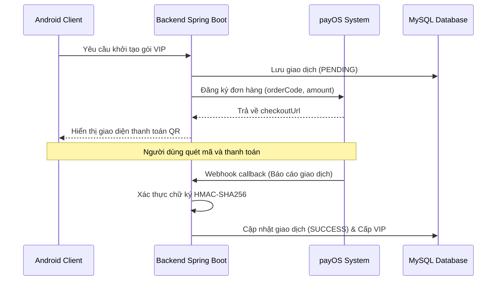
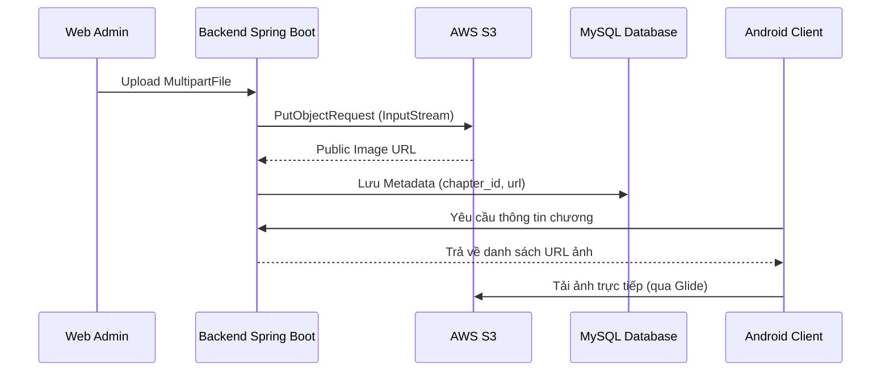
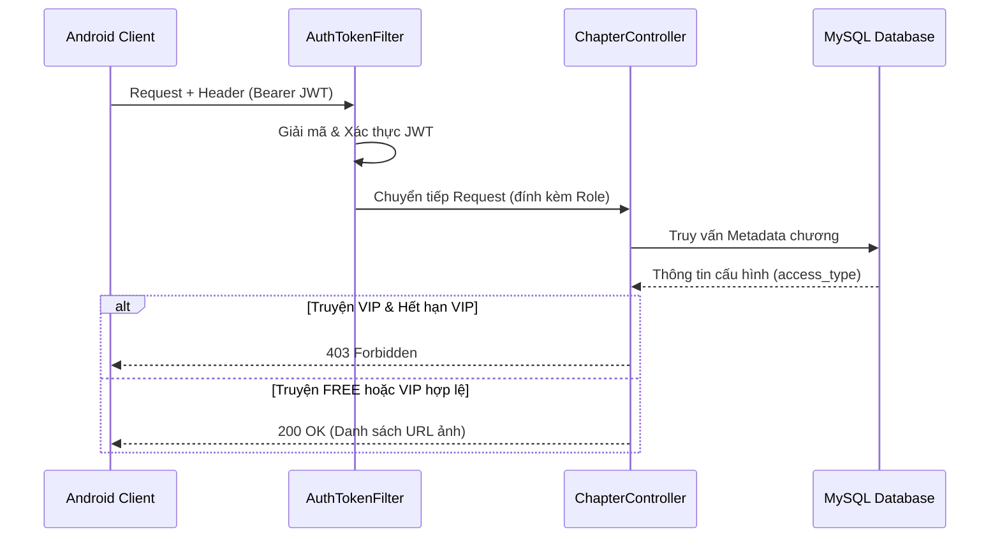
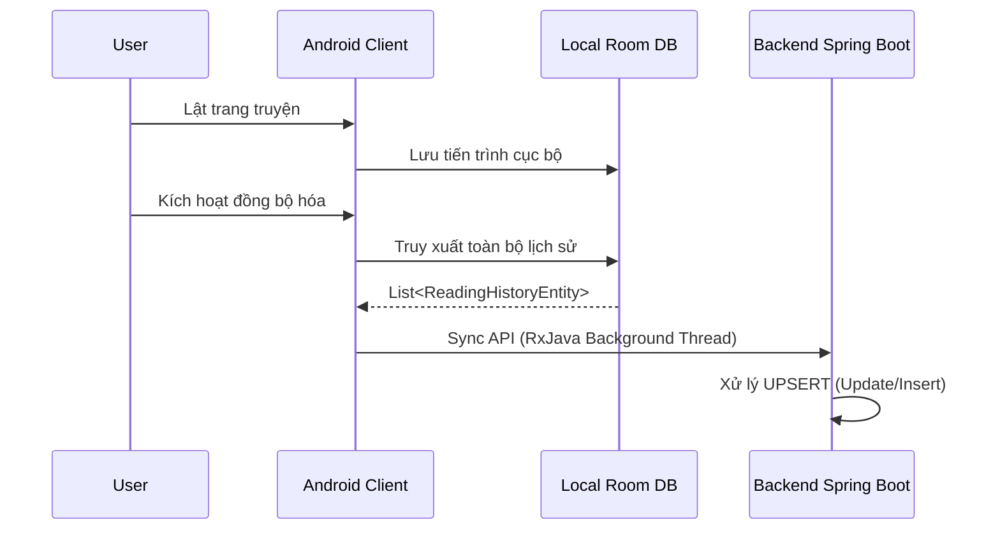

# CHƯƠNG 3. CÀI ĐẶT VÀ TRIỂN KHAI HỆ THỐNG

Chương này trình bày chi tiết về quá trình cài đặt, cấu hình và triển khai các giải pháp kỹ thuật cốt lõi trong hệ thống ComicVerse. Nội dung tập trung phân tích các bài toán thực tế, kiến trúc giải pháp, luồng xử lý dữ liệu và đánh giá hiệu năng dựa trên mã nguồn thực tế của dự án.

## 3.1. Tích hợp thanh toán tự động với payOS

### 3.1.1. Bài toán đặt ra
Trong mô hình kinh doanh nội dung số, việc cung cấp trải nghiệm thanh toán thuận tiện và tự động là yếu tố then chốt. Bài toán đặt ra là cần xây dựng một cơ sở hạ tầng thanh toán cho phép người dùng nâng cấp gói VIP thông qua phương thức chuyển khoản ngân hàng quét mã QR. Hệ thống cần đảm bảo khả năng ghi nhận giao dịch tự động 24/7, xác thực tính toàn vẹn của dữ liệu giao dịch để phòng chống gian lận, và xử lý đồng bộ trạng thái tài khoản người dùng ngay sau khi thanh toán thành công mà không cần sự can thiệp thủ công của quản trị viên.

### 3.1.2. Kiến trúc giải pháp
Giải pháp sử dụng nền tảng thanh toán mở payOS (dựa trên chuẩn VietQR). Hệ thống Backend Spring Boot đóng vai trò trung gian, khởi tạo đơn hàng với payOS và cung cấp mã QR cho Android Client. Việc xác nhận giao dịch được thực hiện thông qua cơ chế Webhook callback.



### 3.1.3. Luồng xử lý kỹ thuật
*   **Khởi tạo giao dịch:** Android Client gửi yêu cầu mua gói VIP. Backend Spring Boot tiếp nhận, sinh mã hóa đơn (`orderCode`) dựa trên thời gian hệ thống, và lưu vào MySQL Database với trạng thái `PENDING`.
*   **Giao tiếp cổng thanh toán:** Backend Spring Boot tạo chuỗi dữ liệu giao dịch và ký điện tử bằng thuật toán HMAC-SHA256 để gửi sang API của payOS. payOS trả về liên kết thanh toán chứa mã QR.
*   **Xử lý Webhook callback:** Sau khi giao dịch liên ngân hàng hoàn tất, payOS gửi một Webhook callback về Backend Spring Boot.
*   **Xác thực toàn vẹn dữ liệu:** Hệ thống trích xuất dữ liệu từ Webhook, tính toán lại chữ ký HMAC-SHA256 dựa trên khóa bảo mật cục bộ (Checksum Key) và đối chiếu với chữ ký do payOS cung cấp. Nếu hợp lệ, hệ thống tiến hành cập nhật trạng thái đơn hàng thành `SUCCESS` và kích hoạt thời hạn gói VIP cho người dùng.

### 3.1.4. Đoạn mã tiêu biểu
Bảo mật Webhook callback để phòng chống giao dịch giả mạo. Được triển khai trong phương thức `handleWebhook` của lớp `PayOsService`.

```java
@Transactional
public void handleWebhook(PayOsDto.WebhookRequest webhookRequest) {
    PayOsDto.WebhookData data = webhookRequest.getData();
    // Khôi phục chuỗi dữ liệu gốc theo quy tắc chuẩn hóa của payOS
    String dataStr = "accountNumber=" + (data.getAccountNumber() != null ? data.getAccountNumber() : "") +
            "&amount=" + data.getAmount() +
            "&code=" + data.getCode() +
            "&virtualAccountNumber=" + (data.getVirtualAccountNumber() != null ? data.getVirtualAccountNumber() : "");

    // Tính toán lại chữ ký để xác minh tính toàn vẹn
    String generatedExpectedSignature = generateHmacSHA256(dataStr, payOsConfig.getChecksumKey());
    if (!generatedExpectedSignature.equals(webhookRequest.getSignature())) {
        throw new RuntimeException("Xác thực Webhook không hợp lệ!");
    }
    
    // Tiến hành cập nhật trạng thái giao dịch nếu xác thực thành công
    Transaction transaction = transactionRepository.findByOrderCode(data.getOrderCode()).get();
    transaction.setStatus(TransactionStatus.SUCCESS);
    transactionRepository.save(transaction);
}
```

### 3.1.5. Đánh giá giải pháp
#### Ưu điểm
* Tự động hóa quy trình đối soát giao dịch.
* Cơ chế HMAC-SHA256 đảm bảo tính toàn vẹn dữ liệu cao, giảm nguy cơ tấn công giả mạo yêu cầu (Spoofing).

#### Hạn chế
* Phụ thuộc vào độ ổn định của hệ thống chuyển mạch ngân hàng lõi (Core Banking) và tốc độ gọi Webhook callback từ phía hệ thống payOS.

## 3.2. Quản lý và phân phối tệp phương tiện với AWS S3

### 3.2.1. Bài toán đặt ra
Một ứng dụng đọc truyện tranh yêu cầu lưu trữ và phân phối lượng lớn hình ảnh chất lượng cao. Nếu lưu trữ trực tiếp hình ảnh trên máy chủ ứng dụng (Backend Spring Boot), hệ thống sẽ đối mặt với nguy cơ cạn kiệt dung lượng ổ cứng và suy giảm hiệu suất xử lý I/O khi chịu tải truy cập đồng thời lớn. Bài toán yêu cầu một giải pháp phân tách lớp lưu trữ, cung cấp băng thông phân phối độc lập và tính khả dụng cao.

### 3.2.2. Kiến trúc giải pháp
Hệ thống sử dụng Amazon Simple Storage Service (AWS S3) đóng vai trò là kho lưu trữ đối tượng (Object Storage). Web Admin truyền tệp phương tiện đến Backend Spring Boot, sau đó Backend Spring Boot đóng vai trò như một luồng trung chuyển (Stream) đẩy dữ liệu lên AWS S3 và chỉ lưu trữ đường dẫn (URL) vào MySQL Database.



### 3.2.3. Luồng xử lý kỹ thuật
*   **Tải lên tệp phương tiện:** Tại Web Admin, các tệp hình ảnh được phân tích cấu trúc chương và đẩy tuần tự dưới dạng `MultipartFile` lên API của Backend Spring Boot.
*   **Chuyển tiếp Stream:** Backend Spring Boot không ghi tệp xuống ổ đĩa vật lý (Disk) mà sử dụng `AmazonS3Client` để truyền trực tiếp luồng dữ liệu (`InputStream`) lên không gian lưu trữ (Bucket) của AWS S3.
*   **Quản lý siêu dữ liệu:** Sau khi AWS S3 ghi nhận tệp, Backend Spring Boot lấy đường dẫn URL công khai và lưu vào MySQL Database, gắn với ID của chương truyện tương ứng.
*   **Phân phối nội dung:** Android Client truy vấn API để lấy danh sách URL và sử dụng thư viện Glide để xử lý luồng tải hình ảnh trực tiếp từ hạ tầng mạng của AWS S3, giảm tải cho Backend Spring Boot.

### 3.2.4. Đoạn mã tiêu biểu
Kỹ thuật truyền luồng dữ liệu tệp trực tiếp lên AWS S3. Được triển khai trong phương thức `uploadFileWithKey` của lớp `S3ServiceImpl`.

```java
public String uploadFileWithKey(MultipartFile file, String s3Key) {
    ObjectMetadata metadata = new ObjectMetadata();
    metadata.setContentLength(file.getSize());
    metadata.setContentType(file.getContentType());
    
    try {
        // Sử dụng luồng InputStream để tránh việc lưu file vật lý trên máy chủ
        PutObjectRequest request = new PutObjectRequest(bucketName, s3Key, file.getInputStream(), metadata);
        request.withCannedAcl(CannedAccessControlList.PublicRead);
        
        // Tiến hành đẩy dữ liệu lên AWS S3
        amazonS3.putObject(request);
        return amazonS3.getUrl(bucketName, s3Key).toString();
    } catch (IOException e) {
        throw new RuntimeException("Lỗi trong quá trình đọc luồng dữ liệu", e);
    }
}
```

### 3.2.5. Đánh giá giải pháp
#### Ưu điểm
* Giải phóng tài nguyên Disk I/O và băng thông mạng cho Backend Spring Boot.
* Khả năng mở rộng lưu trữ của AWS S3 là linh hoạt; ứng dụng tải ảnh trực tiếp từ hạ tầng mạng độc lập giúp cải thiện tốc độ tải trang nội dung.

#### Hạn chế
* Cần duy trì kết nối mạng ổn định từ Backend Spring Boot tới Data Center của AWS trong quá trình xử lý tải lên khối lượng lớn.
* Phát sinh chi phí duy trì dịch vụ lưu trữ đám mây.

## 3.3. Bảo mật kiến trúc phân quyền bằng JWT Authentication

### 3.3.1. Bài toán đặt ra
Hệ thống cung cấp cơ chế phân loại nội dung truyện (Miễn phí và VIP). Việc xác thực quyền truy cập của người dùng cho từng yêu cầu (Request) cần diễn ra nhanh chóng, ít độ trễ, và không phụ thuộc vào trạng thái phiên làm việc (Stateless). Hệ thống cần một phương thức bảo mật luồng API để đảm bảo chỉ những người dùng sở hữu trạng thái VIP hợp lệ mới có quyền tiếp cận các dữ liệu trả phí.

### 3.3.2. Kiến trúc giải pháp
Giải pháp áp dụng cơ chế xác thực dựa trên chuẩn JSON Web Token (JWT Authentication). Token đóng vai trò là chứng chỉ điện tử chứa định danh và quyền hạn (Role) của người dùng, được bảo vệ tính toàn vẹn bằng chữ ký số. Backend Spring Boot tích hợp Spring Security để thiết lập một chuỗi bộ lọc (Filter Chain) đánh giá Token trước khi yêu cầu chạm đến logic nghiệp vụ.



### 3.3.3. Luồng xử lý kỹ thuật
*   **Cấp phát Token:** Trong quy trình Đăng nhập, Backend Spring Boot tạo ra một chuỗi JWT lưu trữ ID và Role của người dùng, ký bằng thuật toán HMAC-SHA256, sau đó cung cấp lại cho Android Client.
*   **Đính kèm Token:** Android Client sử dụng `Interceptor` của thư viện Retrofit để đính kèm tự động JWT vào Header (chuẩn `Authorization: Bearer <token>`) đối với các giao tiếp mạng có yêu cầu xác thực.
*   **Kiểm tra tính hợp lệ:** Khi một Request được gửi tới Backend Spring Boot, bộ lọc `AuthTokenFilter` tiến hành bóc tách và giải mã chữ ký JWT. Hệ thống thiết lập bối cảnh bảo mật (Security Context) chứa thông tin đặc quyền hiện tại.
*   **Xác thực đặc quyền (Authorization):** Hệ thống đối chiếu cấu hình phân loại nội dung (Access Type) của chương truyện. Đối với chương VIP, hệ thống tiến hành kiểm tra thời hạn gói VIP của định danh người dùng trong MySQL Database và từ chối xử lý (trả về mã `403 Forbidden`) nếu không thỏa mãn điều kiện.

### 3.3.4. Đoạn mã tiêu biểu
Kiểm tra đặc quyền truy cập nội dung VIP. Được triển khai trong phương thức `getChapterContent` của lớp `PublicChapterServiceImpl`.

```java
// Kiểm tra cấu hình bảo mật của chương truyện
if (AccessType.VIP.equals(chapter.getAccessType())) {
    Authentication auth = SecurityContextHolder.getContext().getAuthentication();
    if (auth == null || !auth.isAuthenticated() || "anonymousUser".equals(auth.getPrincipal())) {
        throw new ResponseStatusException(HttpStatus.FORBIDDEN, "Yêu cầu đăng nhập để xem nội dung VIP");
    }
    
    // Kiểm tra thời hạn hiệu lực của Gói cước (Subscription)
    com.datn.backend.entity.User user = userRepository.findByEmail(auth.getName()).get();
    List<Subscription> activeSubs = subscriptionRepository.findByUserIdAndStatus(user.getId(), SubscriptionStatus.ACTIVE);
    
    boolean isVip = activeSubs.stream()
            .anyMatch(sub -> sub.getEndDate() == null || sub.getEndDate().isAfter(LocalDateTime.now()));
            
    if (!isVip) {
        throw new ResponseStatusException(HttpStatus.FORBIDDEN, "Gói VIP đã hết hạn");
    }
}
```

### 3.3.5. Đánh giá giải pháp
#### Ưu điểm
* JWT Authentication duy trì tính chất Stateless cho kiến trúc máy chủ, hỗ trợ thuận lợi cho việc nhân bản ứng dụng (Horizontal Scaling).
* Bộ lọc Spring Security thiết lập lá chắn truy cập tại tầng mạng, đảm bảo dữ liệu nội dung được cách ly an toàn.

#### Hạn chế
* JWT không thể bị vô hiệu hóa cục bộ trước thời hạn sống của nó (trừ khi áp dụng cơ chế Blacklist token phức tạp).
* Việc đính kèm Token trong Header làm tăng nhẹ kích thước gói tin mạng truyền tải.

## 3.4. Hệ thống đồng bộ hóa tiến trình đọc

### 3.4.1. Bài toán đặt ra
Để duy trì tính liên tục trong trải nghiệm người dùng, hệ thống cần ghi nhớ chính xác chương và trang truyện mà người dùng đang theo dõi. Tuy nhiên, việc khởi tạo một giao thức mạng (Network Request) lưu dữ liệu lên máy chủ ứng với mỗi thao tác lật trang truyện sẽ đẩy hệ thống vào nguy cơ quá tải Request, đồng thời gây suy giảm hiệu suất hiển thị (Latency) trên giao diện ứng dụng.

### 3.4.2. Kiến trúc giải pháp
Giải pháp áp dụng mô hình Đồng bộ hóa nền (Background Sync). Dữ liệu tiến trình được ghi nhận vào cơ sở dữ liệu nội bộ (Room Database) của thiết bị Android. Dữ liệu này sau đó được hệ thống tổng hợp và đẩy lên máy chủ định kỳ hoặc dựa trên sự kiện kích hoạt, sử dụng cơ chế lập trình phản ứng (RxJava).



### 3.4.3. Luồng xử lý kỹ thuật
*   **Cập nhật dữ liệu cục bộ:** Tại tầng trình diễn của Android Client, thao tác chuyển trang sẽ tạo mới một cấu trúc dữ liệu tiến trình và đẩy vào luồng phản ứng (RxJava `PublishSubject`). Dữ liệu được ghi vào Room Database sau một độ trễ định trước (Debounce) nhằm giảm thiếu các lệnh I/O tuần tự thừa.
*   **Thu gom dữ liệu:** Android Client tiến hành tổng hợp toàn bộ các bản ghi lịch sử đọc lưu trữ nội bộ.
*   **Đồng bộ hóa bất đồng bộ:** Hệ thống sử dụng toán tử RxJava để chuyển đổi (Map) cấu trúc dữ liệu cục bộ thành định dạng yêu cầu và thực thi giao thức mạng lên Backend Spring Boot trên một luồng nền (Background Thread Schedulers), đảm bảo giao diện không bị gián đoạn.
*   **Xử lý lưu trữ đích (UPSERT):** Tại Backend Spring Boot, hệ thống kiểm tra sự tồn tại của bản ghi lịch sử tương ứng với định danh người dùng. Hệ thống tiến hành cập nhật (Update) nếu bản ghi đã hiện diện, hoặc thêm mới (Insert) đối với truyện đọc lần đầu.

### 3.4.4. Đoạn mã tiêu biểu
Kỹ thuật gom nhóm và đồng bộ dữ liệu đa luồng thông qua RxJava. Được triển khai trong phương thức `syncData` của lớp `ProfileFragment`.

```java
readingHistoryDao.getAllHistory()
        .subscribeOn(Schedulers.io()) // Khởi chạy truy vấn DB trên luồng nền
        .flatMapCompletable(historyList -> {
            if (historyList == null || historyList.isEmpty()) {
                return Completable.complete();
            }
            // Chuyển đổi danh sách Thực thể cục bộ thành Request DTO
            return Observable.fromIterable(historyList)
                    .map(entity -> new ReadingHistoryRequest(
                            entity.comicId, entity.chapterId, entity.pageIndex))
                    .toList()
                    .flatMapCompletable(requests -> apiService.syncReadingHistory(requests));
        })
        .observeOn(AndroidSchedulers.mainThread()) // Trả luồng về UI Thread để thông báo
        .subscribe(() -> {
            Toast.makeText(requireContext(), "Đồng bộ tiến trình thành công", Toast.LENGTH_SHORT).show();
        });
```

### 3.4.5. Đánh giá giải pháp
#### Ưu điểm
* Tách biệt tác vụ theo dõi tiến trình khỏi luồng xử lý UI chính, giúp giao diện đọc truyện vận hành ổn định.
* Ứng dụng duy trì tính khả dụng ngay cả khi gián đoạn kết nối mạng (dữ liệu tạm lưu trên Room Database và được đồng bộ ở chu kỳ sau).

#### Hạn chế
* Dữ liệu tiến trình đọc trên hệ thống máy chủ bị trễ một khoảng thời gian ngắn so với trạng thái thực tế hiển thị trên thiết bị.
* Hiện hữu rủi ro mất dữ liệu nếu ứng dụng bị gỡ cài đặt trước khi chu kỳ đồng bộ được thực thi.
